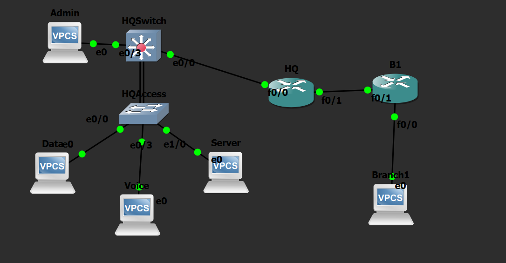

# Cisco Multi-Site Enterprise Network Design

## Overview
This project demonstrates the design, deployment, and verification of a multi-site enterprise network infrastructure built using GNS3. It features an HQ campus layout with VLAN segmentation, LACP EtherChannel, Layer 3 Inter-VLAN routing, and end-to-end multi-hop routing powered by **OSPF Area 0**.

## Topology Architecture


## Key Technical Features
* **Layer 2 Infrastructure:** VLAN segmentation (Data, Voice, Management), 802.1Q Trunking, and LACP EtherChannel (`port-channel 1`).
* **Layer 3 Switching:** Inter-VLAN routing configured via Switch Virtual Interfaces (SVIs) on the HQ Distribution Switch.
* **Dynamic Routing:** Single-area **OSPF (Area 0)** running across the Distribution Switch, HQ Edge Router, and Branch (B1) Router.
* **Network Management:** In-Band Management via VLAN 99 with local SVI endpoints.
* **Redundancy & Security:** Native VLAN tagging and aggregated links for trunk stability.

## IP Addressing & VLAN Scheme

| Device | Interface / Role | IP Address / Subnet | Function |
| :--- | :--- | :--- | :--- |
| **PC1** | VPCS / Eth0/0 | `10.10.10.10/24` | HQ Data Client (VLAN 10) |
| **HQAccess** | SVI VLAN 99 | `10.10.99.2/24` | Access Switch Management |
| **HQSwitch** | SVI VLAN 10 | `10.10.10.1/24` | Default Gateway (PC1) |
| **HQSwitch** | SVI VLAN 99 | `10.10.99.1/24` | Management Gateway |
| **HQSwitch** | Eth0/0 (L3 Link) | `10.0.0.2/30` | Distribution $\leftrightarrow$ HQ Edge |
| **HQ Router** | Eth0/0 | `10.0.0.1/30` | HQ Edge Core Interface |
| **HQ Router** | Fa0/0 | `10.0.0.5/30` | WAN Link to B1 Branch |
| **B1 Router** | Fa0/0 | `10.0.0.6/30` | Branch WAN Interface |

## Verification & Testing
End-to-end reachability was verified by executing ICMP pings from **PC1** (`10.10.10.10`) all the way across the OSPF WAN link to **B1 Router** (`10.0.0.6`):

```text
PC1> ping 10.0.0.6
84 bytes from 10.0.0.6 icmp_seq=1 ttl=253 time=1.120 ms
84 bytes from 10.0.0.6 icmp_seq=2 ttl=253 time=0.985 ms
84 bytes from 10.0.0.6 icmp_seq=3 ttl=253 time=0.870 ms
```

> **GNS3 Software Note:** Trunk ports are statically configured (`switchport mode trunk`). Dynamic Trunking Protocol (DTP) remains active as `switchport nonegotiate` is omitted from the Cisco IOU/IOL virtual image parser.

---
*Created by [Your Name] — Cisco Network Engineering Portfolio Project*
